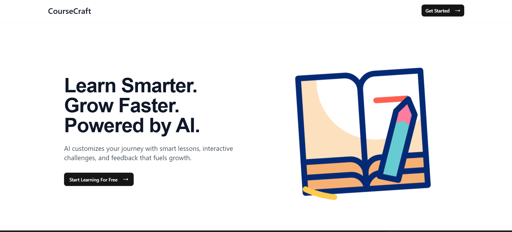
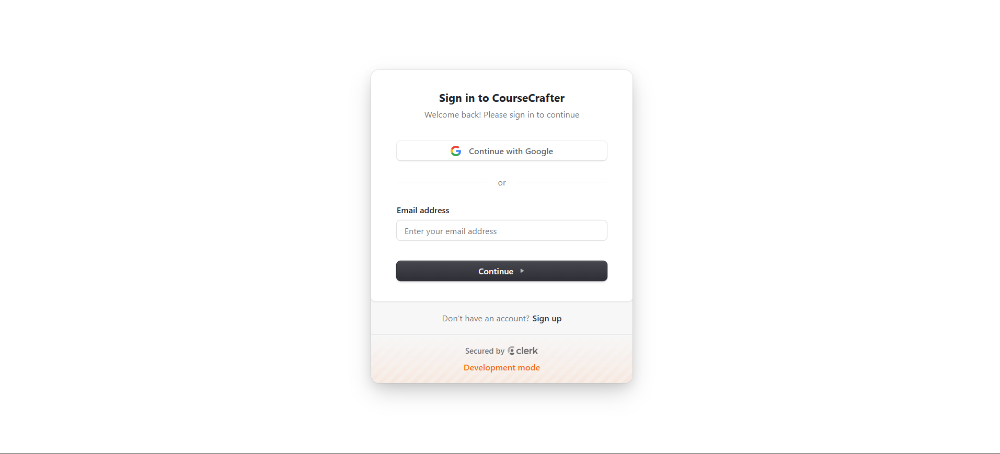
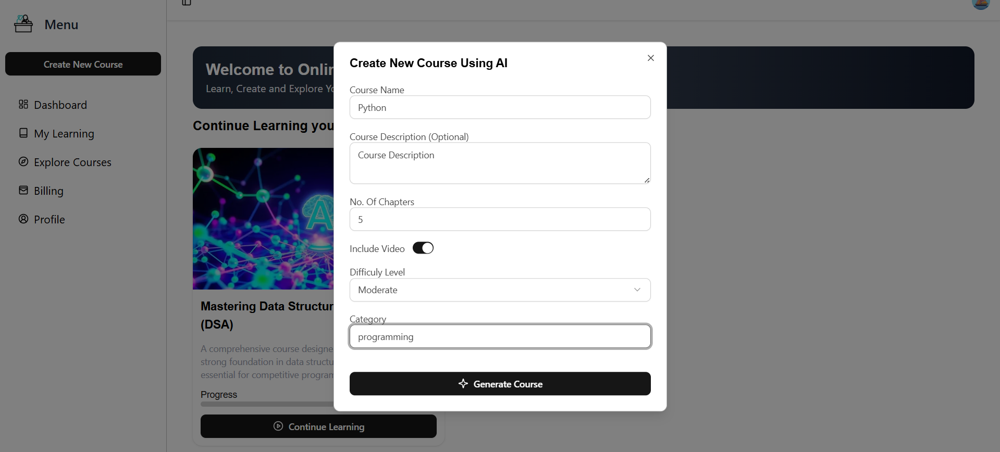
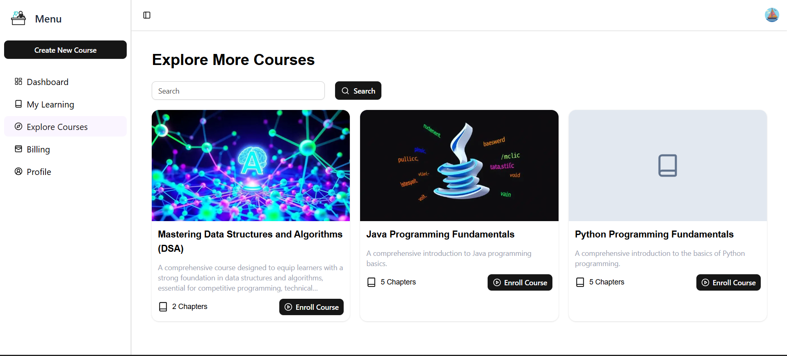
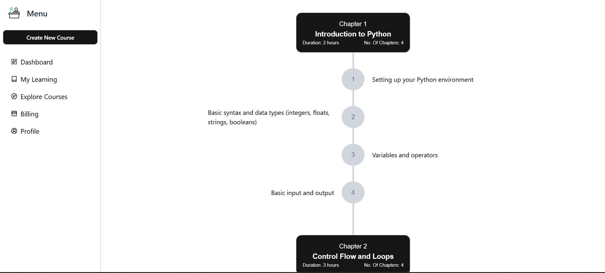
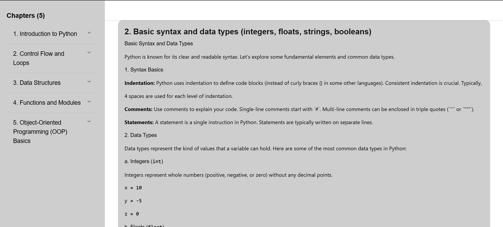
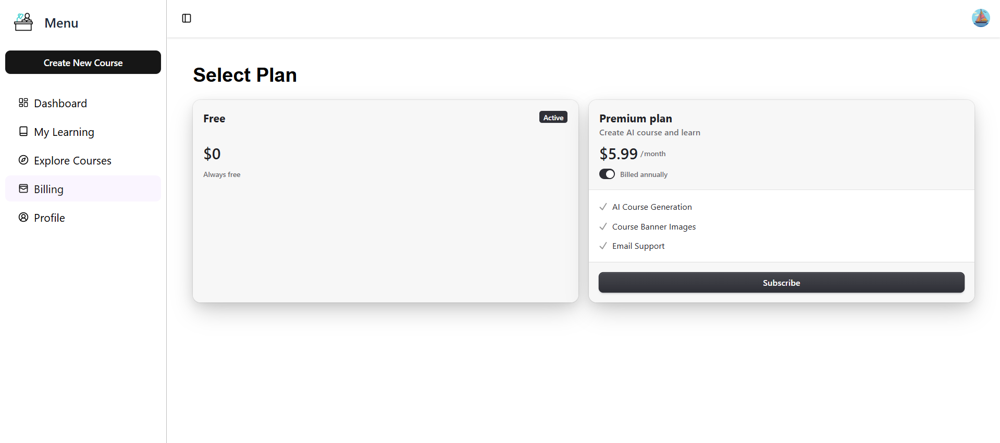

# 🎓 AI Course Generator

An AI-powered personalized course generator that creates structured learning paths based on user input. This platform integrates **YouTube API** to supplement courses with curated video content, offering a rich and engaging educational experience.

## 📸 Screenshots

### 1️⃣ Hero Page – Get Started
Clean and modern landing page with a prominent **Get Started** button.  


---

### 2️⃣ Authentication with Clerk
Sign up or sign in securely using **Clerk** authentication.  


---

### 3️⃣ Creating a Course
Users can enter topic, category, and level to generate a custom course.  


---

### 4️⃣ All Courses Section
Displays all the courses generated so far by all users.  


---

### 5️⃣ Gemini Generated Course Layout
Course outline generated using **Gemini AI** based on user input.  


---

### 6️⃣ YouTube Videos for Each Chapter
Auto-fetched YouTube videos related to each chapter topic.  


---

### 7️⃣ Actual Content in Each Chapter
Detailed AI-generated explanation and content for each chapter.  


---

### 8️⃣ Payment Page for Subscription
SaaS-style subscription or one-time payment to unlock premium benefits.  


## 🚀 Features

- ✨ **AI-Powered Course Generation** using **Gemini API**
- 📺 **YouTube Video Integration** via YouTube Data API
- 🧑‍💻 Built with **Next.js** & **React**
- 💅 Modern UI with **Tailwind CSS** and **ShadCN UI**
- 🔐 **Authentication** using **Clerk**
- 💳 **Payment Support** via Clerk billing (or Stripe integration ready)
- 📚 Dynamic multi-chapter course structure
- 🧠 Smart difficulty level & category tagging

---

## 🧠 How It Works

1. **User Input**: Learners enter their topic, level, and preferences.
2. **Gemini AI**: Generates a tailored course outline.
3. **YouTube API**: Fetches the most relevant videos for each chapter.
4. **Dynamic UI**: Course layout displayed with clean, interactive UI components.
5. **Authentication**: Users can sign in, save, and revisit generated courses.
6. **Optional Payment**: Monetize course generation or premium features.

---

## 🛠️ Tech Stack

| Tech            | Description                                 |
|-----------------|---------------------------------------------|
| **Next.js**     | Full-stack React framework                  |
| **React**       | UI Library                                  |
| **Tailwind CSS**| Utility-first CSS for styling               |
| **ShadCN UI**   | Prebuilt accessible components              |
| **Gemini API**  | Used to generate course outlines            |
| **YouTube API** | To embed relevant video resources           |
| **Clerk**       | Authentication & optional billing integration |
| **JavaScript**  | Programming Language                        |

---

## 🔐 Authentication

- Sign-up & Sign-in via **Clerk**
- JWT-protected API routes
- User-specific course history

---

## 💳 Payments

> Payments are handled through Clerk or can be extended using **Stripe** for managing subscriptions or pay-per-course models.

---

## 🧪 Setup Instructions

```bash
git clone https://github.com/your-username/ai-course-generator.git
cd ai-course-generator
```
## Install dependencies
```
npm install
```
## Environment variables
cp .env.example .env.local
## Fill in required API keys for:
```
# Clerk Configuration
NEXT_PUBLIC_CLERK_PUBLISHABLE_KEY=
CLERK_SECRET_KEY=
NEXT_PUBLIC_CLERK_SIGN_IN_URL=/sign-in
NEXT_PUBLIC_CLERK_SIGN_IN_FALLBACK_REDIRECT_URL=/
NEXT_PUBLIC_CLERK_SIGN_UP_URL=/sign-up
NEXT_PUBLIC_CLERK_SIGN_UP_FALLBACK_REDIRECT_URL=/
NEXT_PUBLIC_CLERK_SIGN_IN_FALLBACK_REDIRECT_URL=/

# Database Configuration
DATABASE_URL=
NEXT_PUBLIC_DATABASE_URL=

# Gemini API Key
GEMINI_API_KEY=

# AI Guru Lab API
AI_GURU_LAB_API=

# YouTube API Key
YOUTUBE_API_KEY=

```
## Run locally
```
npm run dev
```
